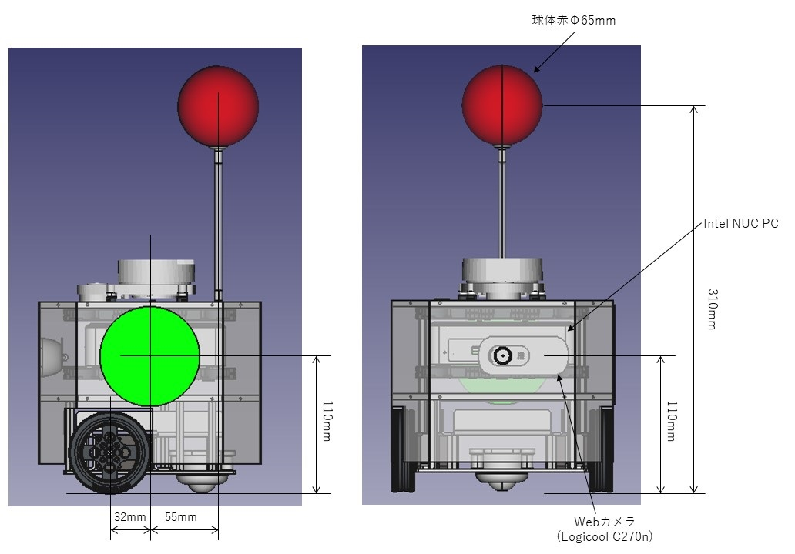

# Burger bot Spec
ベースとなるロボットはTurtlebot3 burgerです。Turtlebot3 burgerにカメラとマーカーなどを追加で搭載しています。

ベースのTurtlebot3 burgerのスペックは下記のサイトを参照ください。

https://emanual.robotis.com/docs/en/platform/turtlebot3/features/

Turtlebot3 burger 寸法(公式サイトより転載)

Burger Bot 配置図

主要部品
|  品名  |  メーカー | 品番  | 備考  |
| ---- | ---- | ---- |---- |
|  Intel NUC PC  |  Intel  |  BOXNUC8I3BEK  | CPU: Core i3-8109U / メモリ: 8GB |
|  NiMHバッテリー  |  NASTIMA  |  NASTIMA 7.2V 4000mAh  | 2直で使用 |
|  Webカメラ  |  Logicool  |  C270n  | - |

カメラ中心とマーカー中心は同じ高さ